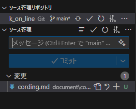
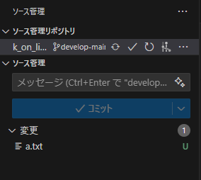
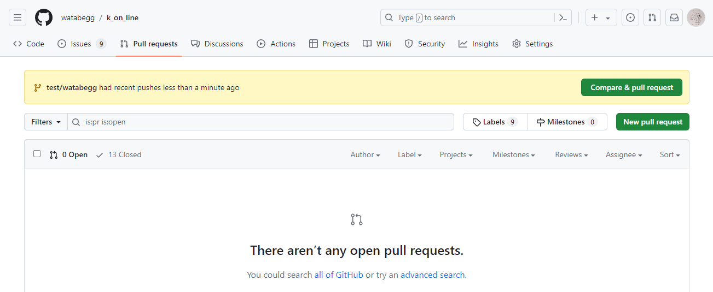
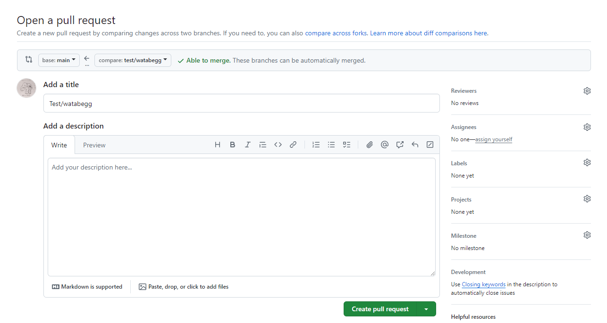
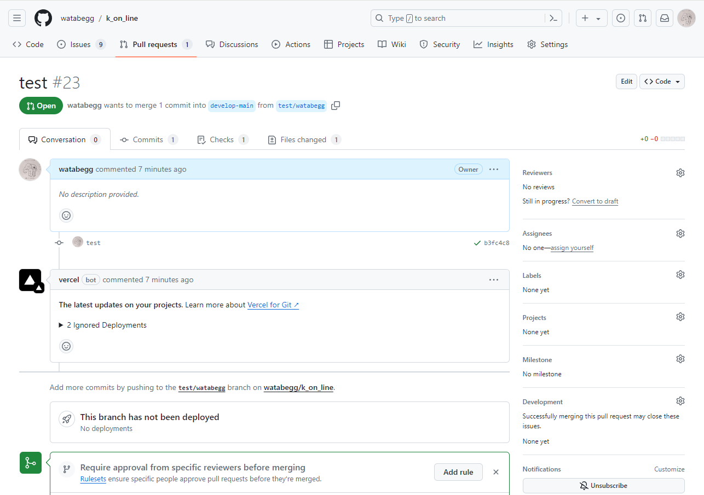

# 開発のためのドキュメント

ここでは実際に開発していくための方法を書いていきます。

## Gitの使い方

チーム開発ではGitの使い方をマスターしなければならないのでまずはそこからです。

### ブランチについて

VS Codeの左側に見える三つのまるがある部分がGitの変更を確認したりできるページです。下の画像のようなページを見ることができますね？



まずは下の画像の赤丸で囲った部分をクリックしましょう。ここは今mainとなっていると思います。
これはブランチといって同じリポジトリ(プロジェクトのファイルのこと)内で同時に別々の変更を行える仕組みのことです。


ここをクリックするとdevelop-mainという名前のブランチが出てくるはずなのでそれをクリックしましょう。


こうすることでdevelop-mainというブランチに移ることができます。基本的に開発ではこのdevelop-mainというブランチに変更を加えていきます。ある程度機能が完成すればmainというブランチに変更を反映させるマージという行為を行います。mainブランチは変更するとあしたぼのコマ表自体が変わってしまうので、基本的に触りません。怖いからね。逆に荒らす場合は変えるといいです。

### コミットとプッシュ

ではGitに変更を加える時はどうすればいいのか、それを行うのがコミットとプッシュです。

なんかめんどくなってきた。気い向いたら書くわ。
=======
# 開発のためのドキュメント
ここでは実際に開発していくための方法を書いていきます。

## Gitの使い方
チーム開発ではGitの使い方をマスターしなければならないのでまずはそこからです。

### ブランチについて
VS Codeの左側に見える三つのまるがある部分がGitの変更を確認したりできるページです。以下ではソース管理タブと呼びます。下の画像のようなページを見ることができますね？


まずは下の画像の赤丸で囲った部分をクリックしましょう。ここは今mainとなっていると思います。
これはブランチといって同じリポジトリ(プロジェクトのファイルのこと)内で同時に別々の変更を行える仕組みのことです。


ここをクリックするとdevelop-mainという名前のブランチが出てくるはずなのでそれをクリックしましょう。こんなところない？じゃあソース管理タブの右上にある「…」からソース管理リポジトリにチェックをつけましょう。そうすると見えるはずです。


こうすることでdevelop-mainというブランチに移ることができます。基本的に開発ではこのdevelop-mainというブランチに変更を加えていきます。ある程度機能が完成すればmainというブランチに変更を反映させるマージという行為を行います。mainブランチは変更するとあしたぼのコマ表自体が変わってしまうので、基本的に触りません。怖いからね。逆に荒らす場合は変えるといいです。

大事なことだしもう一度言うやつやるか、**基本的にmainブランチへの変更はしないでください**

### コミットとプッシュ
ではGitに変更を加える時はどうすればいいのか、それを行うのがコミットとプッシュです。

試しに適当な場所にa.txtというただのファイルを作りましょう。 

**あ～～～～その前に！！！** まずは先ほど述べたように、ブランチがdevelop-mainになっていることを確認してください！develop-mainになっていますね？そうしたらまずソース管理タブから「ソース管理リポジトリ」という項目の、リサイクルマークみたいな二本の矢印をクリックしましょう。  
これはプル(日本語で同期)という操作で、GitHubというところにあがっているみんなのした変更を自分のとこにも持ってこれるやつです。Gitは音楽とは違って魔法じゃないので、自分でこういう操作をしなければなりません。  
**この操作は「よっしゃー！開発やるで～！」となったとき、真っ先に行いましょう。** また開発中も気が向いたらこの操作をしましょう。

では戻りまして、a.txtの中身を適当に書いてからCtrl+Sで保存してください。  
するとソース管理タブのアイコンに1とつきましたね？これが、何かしらのファイルが変更されたという通知みたいなものです。

ではソース管理タブを開いてください。



こんな感じに見えるようになりましたね。ではこの状態で変更と書かれた場所にカーソルを合わせると+のボタンが出てくるはずです。これにカーソルを合わせ続けると「すべての変更をステージ」とか出てくると思います。このステージという操作が「今からGitに変更加えるで～！」という準備の合図になります。ということでこの+のボタンを押して変更をステージしちゃいましょう。  
もちろんこの操作はファイルごとやディレクトリごとにもできます。「このファイルの変更はいったんコミットしたいけどこいつ邪魔やな…」というときは変更したいファイルだけステージしましょう。

ではステージしましたね？ステージすると「コミット」と書かれたボタンが青くなったことが確認できると思います。そうしたらまずコミットメッセージというものを入力します。これは絶対なので書いてください。

コミットメッセージには簡潔にその変更をまとめたメッセージが必要です。この場合なら「コミットテスト」とか「a.txtを追加」とかそういった文言にしましょう。間違っても「うんち」とか「全員殺すからな！」とか書かないようにしましょう。書きたい気持ちはわかる。

これが終わるといよいよコミットです！「コミット」と書いてある青いボタンの隣に下矢印のマークがあると思うのでそこを押して「コミットしてプッシュ」を選びましょう。こうすることであなたのしたa.txtの変更がGitHub上のリポジトリまで適応され、ほかのユーザが同期(プル)をすることでほかのユーザのPCにもあなたのした変更が追加されるようになります。

ここでもしエラーが出たらわたべにスクショ付きで教えてください！やばいエラーじゃないことを祈ります…

これで、おおよそGitの使い方講座は終了、だと思ったか！！！！！！もうちょいだけ付き合って…ホンマに頼む…

### 実際に開発するときは
先ほどはdevelop-mainというブランチに直接コミットとプッシュをしてもらいましたが、実際に開発を進める際は、一度新しいブランチをdevelop-mainから生やしてから、そのブランチに移って、そこにコミットとプッシュをしてもらいます。理由は何となくです。まあ最悪develop-mainに直接コミットしちゃってもいい。

ではこのブランチの作り方、命名規則などを教えていきます。

ブランチは基本、まとまったタスクごとに作ります。例えば「コマ表のメインページのデザインを変更する」とか「役員がログインできるページを追加する」とかそういうのでブランチを作って、そのタスクが終わったら、もとのdevelop-mainにそのブランチをマージすることで変更を反映させていきます。

まずブランチの作り方です。  
ブランチはソース管理のタブから下の画像の赤丸の部分を押します。するといろいろなメニューが出てくるのでここから「ブランチ」>「ブランチの作成」を選択します。


そうするとブランチ名を入力するフォームが出てくるので名前を入力していきます。

ブランチ名は一応僕の中で命名規則を設けていて、といってもしょっぼい規則ですが
- 機能追加はfeature/から、バグ修正や機能修正はfix/から始める
- 行うタスクの概要を簡潔に英単語の羅列で表現する
- 単語ごとの間に-をつける
といった規則です。まあこれさえ統一されてればなんでもいいです。  
あとスラッシュ(/)はハイフン(-)に変わると思いますがこれも気にしないでください。

例えば、役員ログインフォームを作りたいとなれば、ブランチ名は
```
feature/admin-login-form
```
みたいな名前にします。コマ表のデザインを修正するとなれば
```
fix/booking-table-design
```
みたいな名前にします。あんま文法とか単語の統一とか気にしずに、わかればいいです。  
このブランチの中ではなんどコミットでの変更を行ってもいいので1つ簡単な機能が出来ればそれをコミット、もひとつ出来たらまたコミット、今日は寝るからとりあえずコミットみたいな感じでポンポン変更を加えていきましょう。

では今は例として、develop-mainから
```
test/(あなたのGitHubのユーザ名)
```
という名前のブランチを生やしてみましょう。

出来ましたか？では新しく```(あなたのGitHubのユーザ名).txt```という名前のファイルを作って、そのブランチにコミット、プッシュをしましょう。　　
コミットとプッシュをするとき、なんか警告が出るかもしれませんがガン無視でいいです。OK押してください。

こうすると```test/(あなたのGitHubのユーザ名)```にあなたの今加えた変更が反映されました。ではこれを今度はdevelop-main側に反映させる作業、マージを行っていきます。

が！この作業はVS Code上ではなくGitHubのプルリクエストという機能で行います。ま～た知らねえカタカナが出てきてそろそろ切れそうになっていると思いますが落ち着いて聞いてください。

まずGitHubのあしたぼコマ表のコードがおいてあるところ [https://github.com/watabegg/k_on_line](https://github.com/watabegg/k_on_line) に飛びます。

ここのページのメニューに「Pull requests」と書いてあるところがすぐ見えると思うのでここをクリックしてください。

ここのページの右側の「New pull request」と書いてあるボタンか、もしくは上に```test/(Githubのユーザ名)```が書かれた「Compare & pull request」というボタンがありますね。どっちでもいいので押しましょう。ちなみに「Compare & pull request」のほうが楽できます



このボタンを押すと下の画像のようなフォームが出てくるはずです。



このときに下の赤丸の部分base: mainと書いてある部分を押してbase: develop-mainに変更しましょう。


これはマージ元のブランチを決めるものでこれをmainにしちゃってるとそのままmainにマージしちゃうことになるので気をつけましょう(まあミスっても何とでもなる)。

ちゃんとbase: develop-mainになっていることを確認したら下にある「Create pull request」を押しましょう。なんかタイトルとかdescriptionとかは書かなくていいです。めんどいから

「Create pull request」を押すと下の画像みたいな画面に変わりましたね？



なんかごちゃごちゃ書いてありますが全部無視して、ここまできたらこのページのURLをdiscordの「プルリク部屋」というところに貼ってください。マージはちょっと慎重に行いたいのであなた方はダメです。いつかしてもいいよっていうかも

discordにプルリクが送られてきたらわたべが確認してマージを行います。遅くなったらごめん。

このようにして開発を進めていきます。ひとつのタスク、例えば役員ログインフォームが完成した！となったらこのプルリクを作ってマージをしてもらいましょう。

で、たまにこのプルリクの作業ができないことがあります。それがコンフリクトというやつでまああああ～～～～～厄介なのでこれはわたべが直します。プルリク作れませんでした～～～って送ってくれれば直してマージしておきます。ちなみに僕もまだコンフリクトの直し方怪しいからミスったらごめん。

ってな感じで開発を進めていきます！よっしゃ～～～～～準備段階終了！なっげ～～～～～～ってことで続いてはReactの基本編です…
