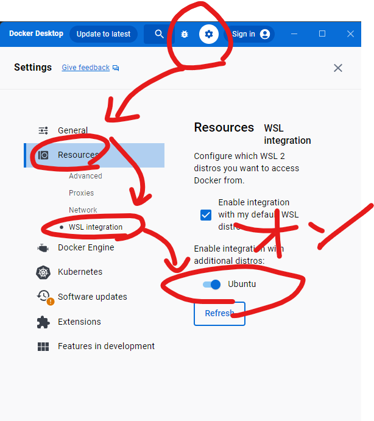

# Dockerを使ったWeb開発のためのドキュメント

## はじめに

あしたぼコマ表開発ではNext.js+TypeScriptを使って開発を行います。
ここでは環境構築のすべてを書くのでちゃんと読んでください。激重です。

## 環境構築

まずいくつかのソフトをインストールしてもらいます。VS CodeやGitのインストール方法はデザインのほうでめっちゃ丁寧に解説しているのでそっち見たほうがはやいかもしれません

### VS Code

インストールしてありますね？してない？じゃあこれ見てしてください！がんばれ！

[VS Codeのインストール方法](https://www602.math.ryukoku.ac.jp/Prog1/vscode-win.html)

追加で拡張機能として「Git graph」「Database Client」「Tailwind CSS IntelliSense」「WSL」あたりを入れておくとよいです。てか入れてください。いるので

### WSL, Ubuntu, Docker

ちょっともうめんどくさくなってきたので雑に説明します。わからなくなったらChat GPTなり、Googleなりで調べてそれでもよくわかんない場合わたべに聞いてください。多分たいていのことはそれでもよくわかんないと思います。

Windowsの下の検索バーから「Windowsの機能の有効化」とか調べると「Windowsの機能の有効化または無効化」という設定フォームが出てくるのでクリックして「Linux用Windowsサブシステム」にチェックを入れてください。


そうしたらwindowsの下の検索バーから「cmd」と検索するなりしてコマンドプロンプトを開いてください。
コマンドプロンプト内で

```bash
wsl --set-default-version 2
```

を実行してwsl2をインストールします。
続いて

```bash
wsl --install -d Ubuntu
```

を実行してUbuntuをインストールします。このインストールの段階で

```bash
Enter new UNIX username:
New password:
```

が聞かれると思います。自分の都合のいいusernameと覚えやすいpasswordを設定しましょう。パスワードは入力しても表示されなくてビビると思いますがただ表示をしていないだけなのでそのまま入力しましょう。

続いてDocker Desktopのインストールです。

[https://www.docker.com/products/docker-desktop/](https://www.docker.com/products/docker-desktop/)

このページからDocker Desktopをインストールしてください。インストールではそこまで大したこと聞かれた覚えがないので適当にyesとかagreeとか押して進めてください。サインインなどはしなくて大丈夫です。

インストールできるとDocker Desktopが起動するはずです。このソフトが今後一番使うことになるのでスタートやデスクトップにピン止めしておきましょう。

そしたら下の画像のように設定からUbuntuの項目をオンにしてください。



出来たら終了です。なんかエラーとか出たら教えてください。

これでおしまいです！やること多かったですね。まだ続きます。

### Git, GitHub

続いてGit, GitHubのインストールと設定です。デザインで書いたやつ丸コピしま～～～～～す！

Git、GitHubは書いたプログラミングのコードの編集履歴を保存するためのシステムです。これを使うとみんなで同じコードを編集することが容易になります。うれしいですね。

まあとりあえず[このページ](https://qiita.com/Kenta-Okuda/items/c3dcd60a80a82147e1bf)見ながらこっちも見つつやってください。

上記のページの2.が終わったらこっちにいったん帰ってきてgitの初期設定を行います。
さっきのコマンドプロンプトというソフトをもう一度立ち上げてください。お察しかもしれませんがこのコマンドプロンプトめちゃくちゃ使うのであんまビビんないでください。

そのコマンドプロンプトでまずは

```bash
git --version
```

を実行しましょう。node.jsでやったことと同じで、ちゃんとインストールされてると

```bash
git version 2.35.3.windows.1
```

とかって出力されます。なんか数字とかが違っても気にしないでください。赤い文字とか出てきたらこれもわたべに相談してください。

続いて

```bash
git config --global user.name "(好きな名前)"
git config --global user.email "(メールアドレス)"
```

を実行します。焦らず一行ずつでいいので実行してください。ちなみに名前とメールアドレスは本当に何でもいいです。僕は

```bash
git config --global user.name "watabegg"
git config --global user.email "roy_wtnb@outlook.jp"
```

で登録してます。やべ、メアドばれてもた。

これでGitの設定は終わりです。まあいったんタバコ吸うか

続いてGitHubのアカウントを作ります。まあ難しいことはないので適当にやります。

[GitHubのページ](https://github.com/)

このページにアクセスしてsign upからページの指示に従ってアカウントを作ってください。作れたらそのユーザネームをわたべに教えてください。

アカウントが出来たらまたコマンドプロンプトを開いてください。
まずはubuntuに入ります。

```bash
wsl
```

を実行するとwslに入れたはずです。ここでエラーが出るとやばそうなのでわたべに要相談です。
現状は

```bash
(ユーザネーム)@(なんかよくわかんない文字列):/mnt/c/Users/user$
```

とかになっていると思うので

```bash
cd ~
```

を実行してください。

そうしたら

```bash
git clone https://github.com/watabegg/k_on_line.git
```

を実行してください。
そうすると

こう出てきたら完璧です！表記自体はちょっと違うはずですがこんな感じ！ナイス！最高！！！出来なかったそこのあなた！地獄行きです！わたべに連絡してください。

ではこれでGit, GitHub編は終了です。二郎とか食べてからタバコを吸いましょう。

#### GitHub Tips

ちなみにGitHubのAIを使ってプログラミングを爆速にする方法があります。

[GitHub Studentに登録してGitHub Copilotを使う方法](https://qiita.com/SNQ-2001/items/796dc5e794ac3f57a945)

これやっとくと便利です。学生証の英訳とかいう今後二度とやるわけない作業がありますが…

これで環境構築は完ぺきなはずです。次はいよいよ実行の準備に移ります。

## 実行編

### VS Codeでリポジトリを開く

まずはVS Codeを立ち上げます。左端のメニューになにやらモニターと><←こういう顔したやつのアイコンがいますね？これをクリックするとUbuntuって書いてあるやつがあると思うので「→」の現在のウィンドウで接続するを選びます。するとVS Codeがwsl上で動くようになりました。

左上の「ファイル(F)」から「ファイルでワークスペースを開く」をクリックしてください。そうするとUbuntuのエクスプローラーが立ち上がります。今はディレクトリが`home/user`とかなんかそういう感じになっていると思うのでそこから`k_on_line`を探し出して開くと「k_on_line.code-workspace」と書かれたファイルが見つかると思います。これをダブルクリックして開いてください。

そうするとやっとあしたぼコマ表のコードが見れるようになったはずです。

ではまずブランチを移動します。

### 環境変数の設定

ではここから本格的な作業を始めます。
まずは上の画像のエクスプローラータブの「tsconfig.json」という名前のファイルの下の何もない空間を右クリックして「新しいファイル…」をクリックしましょう。こうすることで新しいファイルを生成できます。

まずは名前を入力する必要があるので「.env」と入力してください。なんか歯車アイコンが出てきたうえほかのファイルよりファイル名の色が薄くなれば正解です。意味不明ですね。

これは環境変数を設定するためのファイルで、これの中身をインターネット上に公開してしまうと荒らされ放題になってしまうのでこういった対処をしています。では実際に中身を書いていきましょう。

と思いましたが、実はここにも中身は書けません！荒らされてしまうので。

ここまでこれたら一度わたべに連絡して「ステーキ定食、焼き方は弱火でじっくり」と言ってください。.envファイルの中身を送ります。

送られてきたらそれをコピペして.envファイルの中身にはっつけてください。

これが出来たらCtrl+Sでファイルを保存しましょう！

### いざ実行

ではこれを実行していきます！まずはDocker Decktopが起動していることを確認してください。これは絶対条件で、実行中は絶対にDockerを落とさないようにしてください。

VS Codeを開いたままだと思うので左上のターミナルから新しいターミナルを起動して、そこに

```bash
make new
make up
```

と入力して実行してください。
たぶんなんか大量の青文字が出てくると思うのでしばしお待ちください。これがどちらも正確に終了すると実行完了です。

**この際どこかでwarningやerrorが出たらわたべにターミナルのスクショ付きで相談してください。**

これが完了したら

[http://localhost:3000](http://localhost:3000)

にアクセスしましょう。あなたがいつも使っているブラウザで構いません。

すると！あなたのPC上でWebサイトが動くようになりましたね。おめでとうございます。PCが死ぬほど重いと思いますが我慢してください。

### 終了、再起動の方法

では次にこのlocalhostで見える状態を終わらせる方法、もう一度動かす方法をお伝えします。
やり方は簡単で、VS Code上で開いたターミナルで

```bash
make down
```

と実行してください。これでなんかいろいろremoveとかが出ると思うのでおしまいです。この状態になると[http://localhost:3000](http://localhost:3000)にアクセスしても何のデータも取得できないはずです。

この状態になればDockerを閉じても大丈夫です。PCを落とす前や作業を終えたいときに行いましょう。

また再起動は

```bash
make renew
```

を実行すればできます。基本はこれを使うことになるので覚えておいてください。

また、まれにパッケージを増やすことがあるのでその時は僕がまた指示をしますが、

```bash
make clean
```

を実行してから`make renew`を実行してください。

ではこれで実行編は終了です。次は「開発のためのドキュメント」でお会いしましょう！
