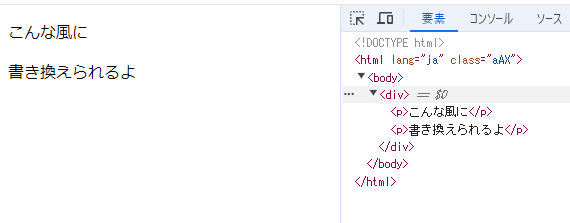

# Reactの基礎
ここからはReact, Next.js, TypeScriptの基礎、基本について解説していきます。VS Codeを開きながら耳をかっぽじって、目を見開いて読んでください。

## Reactのちょっとした紹介
Reactは今FacebookとかInstagramとかやってるMeta社が開発した言語で、もともとWebページを動かしていたJavaScriptという言語をちょっと進化させるためのJavaScriptのライブラリというものです。正式名称はReact.jsです。なので基本的な文法はJavaScriptとおんなじです。使い心地は全然違います。マジで使いやすい。

で、TypeScriptというのがJavaScriptにType(型)を追加したものです。型というとプログラミングをよくやってる電情の方にはなじみのある単語だと思いますが、変数の型ですね。ですね？  
変数の型というのは、てか変数って何？とかの話からする？ムズイな、ちょっとだけするね。  
変数ってのはまあ数学とかでやった${x}$とか${y}$とおんなじで、何かを代入しといたり、ほかの変数の影響で変化したりするものです。Pythonっていう言語で見るとわかりやすくて
```python
apple = 'リンゴ'
x = 1
y = x + 1

print(apple) #リンゴ
print(y) #2
```
みたいに出力される感じのものです。


PythonもJavaScriptも、変数には数字も文字も好きなものを入れていいという仕様なのですが、TypeScriptではその変数に決まった形のものを入れよう、というのが変数の型というものです。型はいろいろあって例えば文字列の```string```、数値の```number```、真偽値(trueかfalse)の```boolean```なんかがよく使うものになります。詳しくはまた後で！

そんで、Next.jsってのがReactのフレームワーク(なんかそういう名前のやつ)です。これもReactに機能を追加したやつで、後述のApp Routerとかなんかいろいろ追加されてるらしい。僕はNextしか触ってないからわからん。

ってな感じです。

## App Router
あ～～もうせっかくプログラミングできると思ったのに意味不明の英単語から始まって最悪の気分ですね。App Routerについてやっていきます。

### App Routerの基礎
App Routerとはなんなのか、僕も別にちゃんと理解してるわけじゃないので雑に説明しますがそんな難しい話じゃないです。VS Codeは開いていますね？じゃあエクスプローラーのタブからファイル見て、srcというフォルダを開いてさらにappというフォルダを開いてください。

page.tsxだのlayout.tsxだのbookingだのいろいろ出てきましたね。なんだこれと思ってるはずです。なんでしょうねぇこれ。

まあ説明するかしゃあないし

まず！このApp Routerというのはずばり、このappというフォルダに入ってるやつらを実際にWebのページとして読み込みますよ～というただそんだけの話です。大層な名前のわりに単純やね～わかりにくい名前つけやがってよお

ただ！これにもいろいろルールがあって、まあ全部解説するのは面倒くさいのでざっくりやります。

まず！app直下のpage.tsxから、意味不明の拡張子ですね。これはreact+typescriptのための拡張子です。まあ知っといてください。
で、この中身を見るとこんな感じ
```tsx
'use client'

import React from 'react'
import MainPage from '@/components/BookingMainPage'

const Page = () => {
  return <MainPage />
}

export default Page
```
みじか！こんな短くていいんや…という感じですがこんな短くていいんです。ほかがくそ長いので
このpage.tsxはreactの仕組みとして、そのpage.tsxとディレクトリと同じパスにアクセスするとpage.tsxを読み込みますよ～というものです。app直下というのはすなわちローカル環境でいうところの localhost:3000 にアクセスした瞬間に読み込まれるということです。

今何が読み込まれているかというと、あしたぼのコマ表ですね。すなわちこれがあしたぼのコマ表を出力しているんです。

え？そんなわけなくない？んな短いので？と思うかもしれませんがまあ焦んな、いったんその話は置いておきます。

では今度はbookingを開いてみましょう。なんかいろいろありますね、page.tsxとlayout.tsx、フォルダにはedit,logs,newがあります。これらのフォルダを開くとまたpage.tsxとlayout.tsxです。無間地獄？

つまり！さっきの話を踏まえて言うと、localhost:3000/booking にアクセスしたときはこのapp/booking直下にあるpage.tsxが、 localhost:3000/booking/new にアクセスしたときはapp/booking/new直下にあるpage.tsxが読み込まれるんです！

まあむずくないよね？単純だよね？ここまでついてこれてる？やばかったら手上げて

で、じゃあlayout.tsxはなんなのという話になりますが、これは読んで字のごとくレイアウトです。まあここは説明難しいからほかのページのコピペでいいよ。てか貼るからこれコピペして
```tsx
import type { Metadata } from 'next'
import { Inter } from 'next/font/google'

const inter = Inter({ subsets: ['latin'] })

export const metadata: Metadata = {
  title: '予約カレンダーページ',
  description: 'あしたぼの予約カレンダー',
}

export default function RootLayout({
  children,
}: Readonly<{
  children: React.ReactNode
}>) {
  return <>{children}</>
}
```
ただ、一点だけ変えてほしいところとしてtitleとdescriptionです。これはそのページのタイトルと説明で、別にざっくり書いてくれればいい！そんで新しいページが必要になったらオナシャス！

### App Routerの応用？
今ブランチがdevelop-mainになっている人はわかると思いますがなんかnot-found.tsxってのが見えますね。これはNext.jsがこのファイル見つけると404エラー、すなわちなんもページないときにこのnot-found.tsxを出してくれるようになるんです。便利ですね～これはまだ適当にしか書いてないので誰かに書いてもらおうと思います。

あとappディレクトリの下にapiって名前のフォルダがありますがこれはバックエンドのためのフォルダです。デザインの人は関係ないけどDockerを使う君らは触ることになります。気合い入れろ！

## Reactのコードをざっくり解説
じゃあやっと！マジでやっと！Reactのコード解説やってくぞ！やばい！これ終わったらおしまい？やば！とっとと終わらせて酒のも！さいこ～！

### そもそもどこが何？
ではまずさっき見せたapp/page.tsxをもう一度ご覧いただきます。
```tsx
'use client'

import React from 'react'
import MainPage from '@/components/BookingMainPage'

const Page = () => {
  return <MainPage />
}

export default Page
```
お分かりいただけただろうか…

いやわかんないか、ぼくもわかんない。

え～ではまず一行目から、
```tsx
'use client'
```
これはなんか正直よくわかっていません。書くべきところと書かなくていいところと違う文言を書く必要があるところがあります。後述する```useEffect```や```useState```を書くときに一行目に必ず必要なんですが、ここには書かなくていいのかも。詳しくはReact公式ドキュメントや誰かの書いたQiitaを読んでください。

[React公式ドキュメント](https://ja.react.dev/reference/rsc/use-client)

#### 追記:後述するって言ったけどめんどくなってやめてもた。じゃあな！

では続いて
```tsx
import React from 'react'
import MainPage from '@/components/BookingMainPage'
```
の部分。はいったん飛ばします。とりあえずMainPageというのがなんかインポートされてんだなということを把握しといてください。

では次に
```tsx
const Page = () => {
  return <MainPage />
}

export default Page
```
ここ。これがこのファイルのメイン部分です。まずJavaScriptからの文法として```const```ってのがあります。これは変数や関数の定義でよく使う宣言の文言で
```js
const ten = 10
```
とかtenという10の数値を表す変数を宣言したい！というときに使う単語です。宣言というのはこの変数を出す初回に、「すんません！今からこの名前の変数使うんで！オナシャス！」というときにすることです。それ以降はconst要りません。  
また```const```は多分constantの略で、要は変数というより定数なんですが、その辺は[このページ](https://qiita.com/cheez921/items/7b57835cb76e70dd0fc4)見てください。てか必要やから見てね。

ここではconstで関数となるPageを定義しています。これはプログラミングやっている人ほど意味不明な文法で困っちゃうと思うのですが、Reactでは[アロー関数](https://qiita.com/may88seiji/items/4a49c7c78b55d75d693b)と言って矢印つかって関数を定義することができます。なれると結構便利。

リンクのページにも書いてあるけど
```tsx
const function = (引数...) => {関数の処理}
```
みたいな感じで関数を記述することができます。理解した？でことで実際の処理を見てみると
```tsx
const Page = () => {
  return <MainPage />
}
```
となってますね。すなわちPageという関数は引数無しで呼び出せて呼び出すと```<MainPage />```というものを返すらしいです。ほ～ん

で、このreturnの中には基本的にHTMLタグを書きます。例えば上記のPage関数をHTMLで書き換えてみると
```tsx
const Page = () => {
  return (
    <div>
      <p>こんな風に</p>
      <p>書き換えられるよ</p>
    </div> 
  )
}
```
こんな感じ、このpage関数を呼び出せば


こんな感じのページを作成することができます。なのでデザインを行う人はここをうまいこと書き換える必要があるんですね。覚えておきましょう。

そしてこの関数の記述が終わった後、最後の行に
```tsx
export default Page
```
という記述がありますね、page.tsx内では、この記述をしておいた関数がWebページにアクセスした際に読み込まれるようになっています。これはメインで使う関数の記述が終わった後必ず書きましょう。

このexportとdefaultはそれぞれちょっと異なる動きをするのですが、それはこの後に書くライブラリについてでお話しします。

では先ほどのライブラリの記述について戻ります。

さきほどのpage.tsxでは以下のインポート文が書かれてましたね。
```tsx
import React from 'react'
import MainPage from '@/components/BookingMainPage'
```

これはライブラリやほかのファイルからの関数、変数の読み込みです。ここではReactとMainPageというものを読み込んでいますね。正直これだけではなんか説明しずらいので例をもう一つ上げます。

```tsx
import { useState, useEffect, useRef } from 'react'
import Image from 'next/image'
import { format } from 'date-fns'
import { ja } from 'date-fns/locale'
import { TIME_LIST, Booking } from '@/lib/enum/BookingEnum'
import Popup, { PopupRef } from '@/components/atom/Popup'
import { BookingTableBox } from '@/components/atom/BookingTableBox'
import Loading from '@/components/atom/Loading'

import {
  Table,
  TableBody,
  TableCell,
  TableContainer,
  TableHead,
  TableRow,
  Paper,
  Button,
  Stack,
  TableFooter,
  Typography,
} from '@mui/material'
import { PiCircle } from 'react-icons/pi'
import { HiMiniXMark } from 'react-icons/hi2'
```

これはsrc/components/BookingMainPge.tsxの中のimportです。山盛りありますね。多すぎだろ。  
import文の文法は
```tsx
import (欲しい関数や変数), {(欲しい関数や変数)} from '(それがあるファイルやライブラリの名前)'
```
です。今ここで利用できるライブラリはpackage.jsonのdependenciesという項目で確認できます。そのライブラリにどんな関数や変数があるかは自分で調べてください。デザインの人たちにはあとから教えるね♡

基本的にこの文法で書いてくれればエラーは出ません。欲しい関数や変数が複数あるときはコンマで繋げて書いてください。また自分で作ったファイルから関数を違うファイルで読み込むこともできて、例えば
```tsx
import Loading from '@/components/atom/Loading'
```
はsrc/components/atoms/Loading.tsxに記述されている関数です。実際にコードを見るとこんな感じ
```tsx
import { Typography, CircularProgress } from '@mui/material'

const Loading = () => {
  return (
    <div className="flex items-center justify-center h-screen">
      <div className="text-center">
        <CircularProgress />
        <Typography variant="h6" className="mt-4">
          Loading...
        </Typography>
      </div>
    </div>
  )
}

export default Loading
```

すなわち、上記のインポート文でこのLoadingという関数を読み込んでいるわけですね。

そして、ここにも```export default```の記述があります。  
exportとはずばり、ほかのファイルでもこの関数や変数が利用できるようにするよーという意味です。なのでこういういろんな場所でローディング画面を表示するためのコンポーネントなどはこの記述が必要なわけです。  
そして、defaultという記述は、どこか別のコンポーネントでインポートする際に、こいつを標準で出力するよ、という意味です。1つのコンポーネント内ではいくつもexport出来る関数や変数がありますが、default設定できるのは多分一つだけです。

ここで例をもう一つ、Popup.tsxを見てみましょう。
```tsx
import React, { useImperativeHandle, forwardRef } from 'react'
import { Modal, Box, Typography } from '@mui/material'
import { ReactNode } from 'react'
import clsx from 'clsx'

export type PopupRef =
  | {
      show: () => void
      close: () => void
    }
  | undefined

const Popup = forwardRef<
  PopupRef,
  {
    title: string
    children?: ReactNode
    maxWidth?: string
    open: boolean
    onClose: () => void
  }
>(({ title, children, maxWidth, open, onClose }, ref) => {
  useImperativeHandle(ref, () => ({
    show: () => onClose(), 
    close: () => onClose(),
  }))

  return (
    <Modal
      open={ope...
      (略)
    </Modal>
  )
})

Popup.displayName = 'Popup'

export default Popup
```
なげーので省略してますが、ここではexportと記述されているのがPopupRefとPopupの二つありますね、そしてdefaultになっているのはPopupのほうです。ここで先ほどのBookingMainPageでのPopup.tsxからのインポート文を確認しましょう。

```tsx
import Popup, { PopupRef } from '@/components/atom/Popup'
```
あ～～～～～～～！！！！！！！！！！！！！defaultの設定してないほう{}(波かっこ)ついてる～～～～～～～～～～～～～～～！！！！！！！！！！！！！！！！！！！！！！！！！！！！

はい、てことです。OK？

このexportはconstなどの変数、関数宣言の際につけることも、あとからつけることも可能です。覚えといてください。

え～ここまでやればもう後は大丈夫です。多少はどんなことしてるかわかりましたかね？まあこれがReact文法のどこが何？でした。では次回は「いざコード編集してみよう」編でお会いしましょう。なげーな、ハンターハンターかよ
