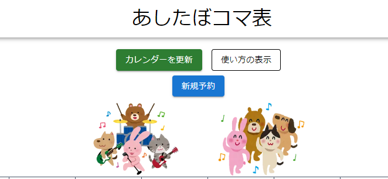
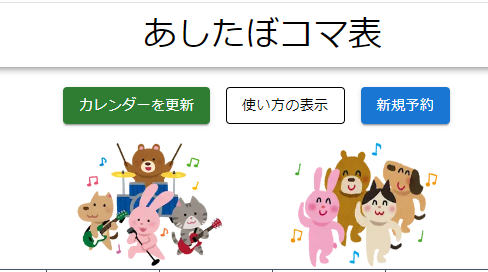
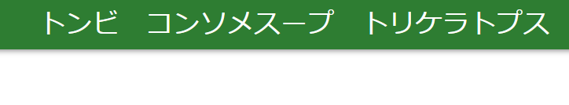
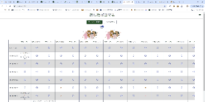
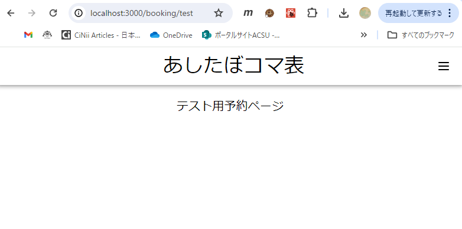

# いざコード編集してみよう - Docker開発編
では！ここからは実際にファイルを編集していってどんな変更を加えれば、Webページにどんな変化が起こるか見ていきましょう。

## はじめに
まず、この資料では実際にコードに変更を加えてその変更を確かめるので
```bash
make renew
```
を実行してから、コードを変更していきましょう。

また、コードの変更を加えると「ソース管理」タブに変更が出てきますがここで変更したコードは、リポジトリにコミットやプッシュをしないようにしてください。  
「⤴」こんな感じの矢印アイコンをクリックすると今までの変更をすべて戻すことが可能なので、このページの課題が一通り終わったら、もしくは飽きたら、このボタンで今までの変更をなくしちゃいましょう。ただ、課題の大きなくくりの中では変更の削除をしないほうがいいです。後悔します。

あとわかんないことやエラーが出たら、変更したコードと今どういう出力になっているかをスクショしてDiscordで聞いてください。Discordで聞くことでみんなにどういうひっかけがあるか共有できることになるので、そちらでお願いします。

あとこれで合ってんのかわかんないときもわたべに聞いてください。まあこんなことやるなら[progate](https://prog-8.com/)やったほうがはやいんすけどねw

## 課題1 - HTML部分を編集しよう
まずはHTML部分の編集からです。まあてきとーにこなしてください。

### 課題1-1　「使い方の表示」の内容変更
はじめにあしたぼコマ表の「使い方の表示」を押すと出てくる使い方の説明を編集しましょう。内容は何でもいいですが文字列にはしっかり改行をいれたり、画像を入れてみたり、チャレンジできることは何でもしましょう。どこかに平文で書いてあるので探してみてください。

### 課題1-2　ボタンを押したときの挙動の変更
「使い方の表示」ボタンは現状、おすとさっき編集した使い方のページがモーダルウィンドウとして表示されます。これを新規予約ページ(URLでいうとlocalhost:3000/booking/new)に遷移するボタンに変更してみましょう。
こういったボタンは
```tsx
<Button
  variant="outlined"
  color="inherit"
  onClick={() => setIsPopupOpen(true)}
>
  使い方の表示
</Button>
```
こんな感じで実装されていて、このButtonタグを使えば新しいボタンを作ることができます。今回編集するのはこのButtonタグのonClickというところで、ここはボタンがクリックされた時の挙動を書くことができます。この挙動を変更してもらいます。

まず、ちょっと直接教えますがBookingMainPage.tsxの最初のほうの記述を以下のように変更してください
```tsx
'use client'

import { useState, useEffect, useRef } from 'react'
import { useRouter } from 'next/navigation' // ここと
import Image from 'next/image'
import { format } from 'date-fns'
(中略)
import { PiCircle } from 'react-icons/pi'
import { HiMiniXMark } from 'react-icons/hi2'

const ArrayDayList = Array.from({ length: 15 }, (_, i) => i - 1)

const MainPage = () => {
	const today = new Date()
    const router = useRouter() // ここを追加
	(中略)
	const ReadMePopupRef = useRef<PopupRef>(undefined)
```
なにやらrouterという変数が追加されましたね、これが鍵です。BookingMainPage.tsxではこのライブラリを使っていませんがほかのコンポーネントでは使っています。左側の虫眼鏡アイコンをクリックするとそのリポジトリ内での検索が可能なので今追加したコードの単語引っ張り出して検索してみましょう。

一応[公式ドキュメント](https://nextjs.org/docs/pages/api-reference/functions/use-router)も貼っときます。

### 課題1-3 ボタンを追加してみよう
では次に下の画像みたいにボタンを追加してみましょう

使い方の表示ボタンは最初の仕様に戻して、新たにこの下に新規予約と書かれた、localhost:3000/booking/newに遷移するボタンを追加してみましょう。

これ実は少し難しいので下の画像のように横並びでも構いません。色は青にしてみましょう！


え～ヒントは以下のドキュメントを読んでください。英語やけど気合いや  
[Stackタグ](https://mui.com/material-ui/react-stack/)  
[Buttonタグ](https://mui.com/material-ui/react-button/)  

### 課題1-4 ヘッダーを編集してみよう
はいじゃあ今度はヘッダーを編集します。ヘッダーってのはページの一番上についてるやつね、あしたぼコマ表って書いてるやつ。これの色を緑にして、文字をなんか好きなのに変更してみましょう。ちなみにどこのコンポーネントがこれを動かしてるとかはここに書かないので血眼になって探してください。app/layout.tsxにちょっとヒントがあります。


うわ～ぜんぜんかんけーねー

え～ヒントは以下のドキュメントを読んでください。  
[AppBarタグ](https://mui.com/material-ui/react-app-bar/)  
[Typographyタグ](https://mui.com/material-ui/react-typography/)  

まあHTML部分というかデザインはこんなもんでいいでしょう。あとは僕の書いたコードを参考にしたり必死こいてドキュメント読み込んだりエラーにキレ散らかしたりしてください。

## 課題2 - Reactの機能をめっちゃ使ってみよう
ここからはReactの処理部分に深く触れていきます。超重要なので刮目してください。
### 課題2-1 useStateを使いこなせ！
まずは```useState```からです。見慣れね～ですねこんなの、ほかの言語ではなかなか出てこないと思いますこの機能。

```useState```はReactのAPIの一つで
```tsx
import { useState } from 'react'
```
とすると利用できます。利用方法はコンポーネント内で
```tsx
const [状態値, 更新関数] = useState<状態値の型>(初期値)
```
とすることで、```useState```が利用可能になります。なんじゃそりゃという感じですね。ではこの```useState```を使ったコードと、```useState```を使わずに、なおかつPythonで書いた同等の動きをするコードを比較してどんな動きをするのか見てみましょう。

```tsx
// Reactのカウンターコード
import { useState } from 'react'

const Counter = () => {
    // useStateフックを使って状態を定義する
    const [counter, setCounter] = useState<number>(0)

    // カウンターをインクリメントする関数
    const incrementCounter = () => {
        setCounter(counter + 1)
    }

    return (
        <div>
            <p>Counter: {counter}</p>
            <button onClick={incrementCounter}>Increment</button>
        </div>
    )
}

export default Counter
```

```python
# Pythonのカウンターコード
counter = 0

def increment_counter():
    global counter
    counter += 1
    print(f"Counter: {counter}")

# カウンターを5回増やす
for _ in range(5):
    increment_counter()
```

これはどちらのコードもカウンターを増やして表示するコードになっていますね。しかし違いとして、Reactのほうにはカウンターの変数っぽいものに代入するみたいな操作がありません。

Reactの```useState```では
```tsx
const [state, setState] = useState<TypeState>(State1)　//　と定義する

console.log(state) // 出力はState1

setState(State2)
console.log(state) // 出力はState2
```
のように宣言での第一変数が状態値、第二変数がその状態値を変更する関数となり作動します。  
ちょっとは理解できましたか？これめちゃくちゃ使うので使いこなせるようにしましょう。以下に参考ページを貼っておきます。

[公式ドキュメント](https://ja.react.dev/reference/react/useState)  
[僕も後から読む結構丁寧なQiita](https://qiita.com/KokiSakano/items/c16a8daf03acdbd6c911)  

てことで、これを使いこなすための課題を一つ出します。

app/components/BookingMainPage.tsxにて、状態値が真偽値(boolean)を取る```useState```を１つ新たに宣言し、その状態値がMUIのSwitchで切り替わるようにし、かつ！状態値が真であるときは、localhost:3000直下に表示されているいらすとやの画像の片方がもう片方と同じになるように実装してください！

なっが、これむっず。どうしようムズイと思うけど頑張って  
見本はこんな感じです。ちょっと小さくて見ずらいけど



**追記:ごめんpdfだとGIF動かんかった**

以下に参考資料を貼っておきます。MUIのドキュメント内にかなりのヒントがあるので探してみましょう。  
[Switchタグ](https://mui.com/material-ui/react-switch/)  
[ReactのReturn内で条件分岐をする方法](https://zenn.dev/tarou_yuruyuru/articles/41194caa645937)

これが実装できるとかなりuseStateを使いこなせています！useStateは嫌というほど使うので覚えておきましょう。

### 課題2-2 useEffectを使いこなせ！
ついさっき出てきた```useState```と同じく```useEffect```もこれまたReactのAPIの一つです、これもいやというほど使います。

```tsx
import { useEffect } from 'react'
```
と記述することで使えるようになり、コンポーネント内で
```tsx
useEffect(() => {
  // 変数の変更で行いたい処理
}, [任意の変数])
```
のように記述すると利用することができます。  
このuseEffectは何がしたいのかというと、上記コードの最後の行に[]で囲まれた任意の変数がありますね？これが更新された時、useEffect内の処理が走るという仕組みになっています。これは後述しますが、useStateと組み合わせて使うことでかなり強力に、簡単にWebのページ更新などを行うことができます。すごい。どういう仕組み？

ではここでもういきなり課題をやってみましょう。

今BookingMainPage内では、「カレンダーを更新」ボタンを押すとuseStateで定義されているbookingsが更新される仕組みになっています。このbookingsが更新されたら「予約が更新されました」というコンソールログを出すように実装してみましょう。コンソールログの使い方は[このページ](https://www.flavor-of-life.com/entry/how_to_javascript_console_log)を参考にしてください。

またBookingMainPageにはすでにbookingsに依存したuseEffectが実装されていますが、自分で新しくもう一つ実装してみましょう。

以下のGIFのように実装できれば完璧です。

.gif>)

ではuseEffectとuseStateのことが若干わかってきたと思いますので次の課題に行きます。

### 課題2-3 useStateとuseEffectのコンボ技を決めよう
ここで行ってもらうのはuseStateとuseEffectのコンボです。何をしてもらうかというとさっきuseStateでreturnの中で条件分岐をして変更してもらっていた画像をuseStateで管理して出力してもらいます。

まずはコンポーネント内で
```tsx
const [orImage, setImage] = useState<>()
```
を定義しておきます。今このuseStateには型と初期値を設定していませんが、それはあなたにお任せします。ちゃんと設定しないときれいに動かないと思います。  
そして画像を表示しているImageタグの部分を
```tsx
<Stack spacing={8} direction="row" className="flex justify-center">
  <Image
    src={orImage} // ここが変更
    alt="logo"
    width={150}
    height={120}
  />
  <Image src="/animal_dance.png" alt="logo" width={150} height={120} />
</Stack>
```
と変えておきましょう。
この状態で先ほど定義したstateのSwitchの値の変更が行われたら新規に定義したuseEffectの処理が発火し、画像が入れ替わるように実装してみましょう。  
これは正直いじわるに難易度をあげています。わからないときは一通り調べてみた後わたべに聞いてください。

## 課題3 - React Hook Formを使うぜ！
ではここからは絶望の始まり、React Hook Formを使って実際に予約のためのフォームを仮作成してみます。本当に面倒くさい可能性があります。

React Hook FormはReactのライブラリで、フォームを作るために特化した結構便利なライブラリになっています。これができるようになると本格的に開発に携われるのでマジで頼みます。

### 課題3-1 新しいページとコンポーネントを作ろう
ではまずapp/bookingの配下に新しいフォルダ、testを作ってその中にpage.tsxとlayout.tsxを作りましょう。正直ここはコピペでいいのでbooking/newとかその辺から持ってきちゃいましょう。

そして今作ったpage.tsxの中で読み込むコンポーネントとしてsrc/componentsの中にtest.tsxというファイルを作成しましょう。このコンポーネントの中身を書いて、booking/testのpage.tsxで読み込み、localhost:3000/booking/testにアクセスしたときにこのtest.tsxの中身をちゃんと出力できるか、というのがこの課題の内容です。

ではtest.tsxの中身を指定します。と言っても別に今は大したことを書く必要はありません。MUIのTypographyを使ってhtmlの```<h6>```タグの大きさに相当するフォントサイズで中央ぞろえをし、「テスト用予約ページ」と表示しましょう。



localhost:3000/booking/testにアクセスし、このようなページを見ることが出来たら成功です。
ちなみにtest.tsxは11行あればかけちゃいます。頑張ってください。

ヒント:　[Typographyタグの仕様](https://mui.com/material-ui/api/typography/)

### 課題3-2 フォームを作ってみよう
ではtestのページが出来たら、ここに予約フォームを作っていきます。といってもやることは基本パクリです。


## 課題4 - バックエンド開発


